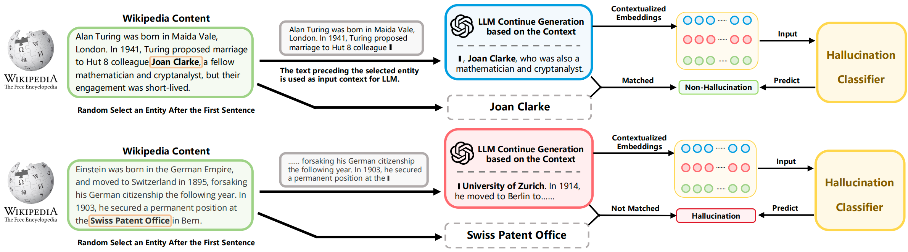

# MIND: Unsupervised Hallucination Detection Framework for LLMs

Welcome to the official GitHub repository for our latest research on hallucination detection in Large Language Models (LLMs), titled **"MIND: Unsupervised Modeling of Internal States for Hallucination Detection of Large Language Models"**. In this work, we introduce a novel, unsupervised framework designed to address the challenges of existing hallucination detection methods. 

## Overview

Our research highlights the limitations of current post-processing methods used in hallucination detection, including their high computational costs, latency, and inability to understand how hallucinations are generated within LLMs. To overcome these challenges, we propose **MIND**, an unsupervised and real-time hallucination detection framework that significantly reduces computational overhead and detection latency, and is compatible with any Transformer-based LLM.

**MIND** extracts pseudo-training data directly from Wikipedia, eliminating the need for manual annotation, and uses a simple multi-layer perceptron model to perform hallucination detection during the LLM's inference process.



## Benchmark: HELM

To further contribute to the field, we introduce a new benchmark named **HELM (Hallucination Evaluation for multiple LLMs)**, aimed at improving the reproducibility of our findings and facilitating future research. Unlike previous benchmarks, HELM provides texts produced by six different LLMs along with human-annotated hallucination labels, contextualized embeddings, self-attentions, and hidden-layer activations. This comprehensive dataset offers invaluable insights into the internal states of LLMs during the inference process.


## Repository Content

In this repository, we provide:

- Complete source code for the **MIND** framework.
- Instructions for setting up and running **MIND**.
- Access to the **HELM** benchmark, including detailed documentation on how to use it for your own research.

## Getting Started

### Requirements

```
numpy==1.25.2
pandas==2.0.3
scikit_learn==1.3.0
spacy==3.6.1
torch==2.0.1
tqdm==4.66.1
transformers==4.31.0
```


### Install Environment

```bash
conda create -n MIND python=3.9
conda activate MIND
pip install torch==2.0.1
pip install -r ./requirements.txt
```


### Step 1

Run `./generate_data.py` to automatically annotate the dataset based on wiki data. You can modify hyperparameters, paths, model names, and sizes in the file.

### Step 2

Run `generate_hd.py` to generate features needed for training the classifier based on the automatically annotated data.

### Step 3

Run `./train/train.py` to train the classifier.

### Step 4

Run `./detection_score.py` to evaluate the classifier's performance on the HELM dataset.